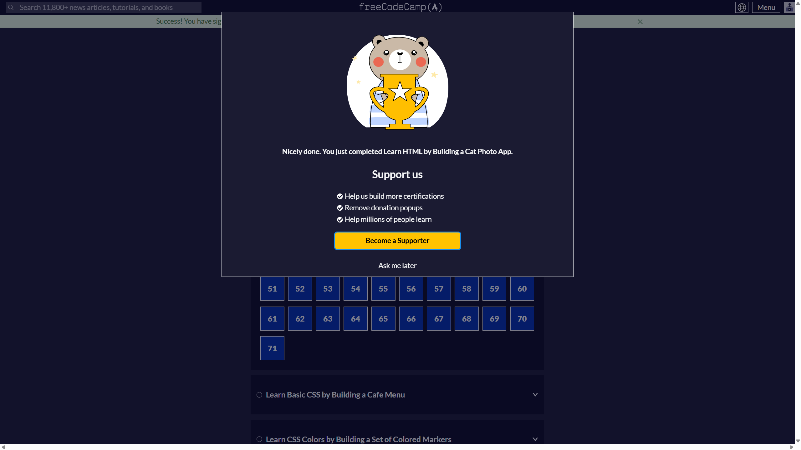

# learning-log

Tracking my progress as I work toward becoming a developer.

## ✅ Completed: freeCodeCamp HTML Section

After about 4 days of solid work, I finished the first major HTML section on freeCodeCamp.  
Here’s a screenshot showing the completion:

Next up: CSS basics and projects.
